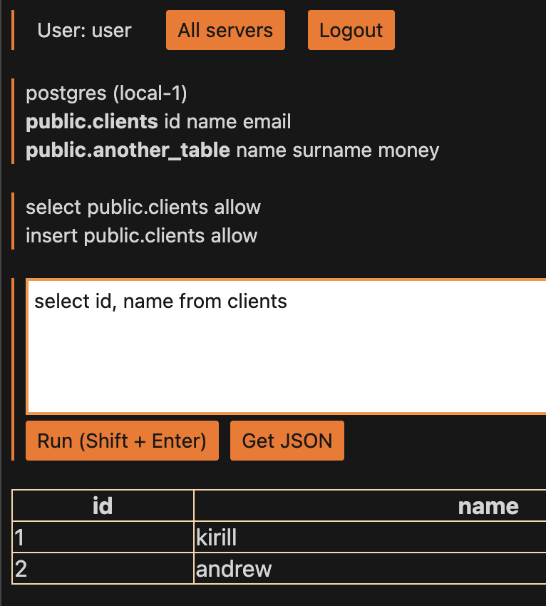

# Database Gateway

This service provides a unified web interface for secure, controlled access to company databases. It enables employees
to run queries on `production` databases while enforcing access control (`ACL`) policies. For example, team leads may
have permissions to execute both `SELECT` and `INSERT` queries on certain tables, while other team members are
restricted to read-only (`SELECT`) access. This approach ensures that database interactions are managed safely and
that each user’s access is tailored to their role and responsibilities.

## Quickstart with example setup

Run commands to get a local dbgw instance with 3 postgres.

```shell
git clone https://github.com/kazhuravlev/database-gateway.git
cd database-gateway/example
docker compose up --pull always --force-recreate -d
open 'http://127.0.0.1:8080'
# Username: test@example.com
# Password: password
```

You will see only 2 instances from 3 postgres instances (`local-1`, `local-2`,`local-3`) because ACL is applied to test
user. ACLs stored in [config.json](example/config.json).


Choose `local-1`, put this query `select id, name from clients` and click `Run` 

## Features

- [x] Supports any PostgreSQL wire-protocol database, including PostgreSQL and CockroachDB
- [x] Allows hardcoded user configuration via config file
- [x] Integrates with OpenID Connect for user authentication
- [x] Enforces access filtering through ACLs
- [x] Provides query result output in HTML format
- [x] Provides query result output in JSON format
- [ ] Output query results in CSV format
- [ ] MySQL support
- [ ] Query history tracking
- [x] Unique links for query results (useful for debugging)
- [ ] API for test automation

## Interesting projects

- https://github.com/vitessio/vitess
- https://github.com/blastrain/vitess-sqlparser
- https://github.com/antlr/grammars-v4/tree/master/sql/postgresql/Go
- https://github.com/pingcap/tidb/pkg/parser
- https://github.com/xwb1989/sqlparser
- https://github.com/cockroachdb/cockroach/pkg/sql/parser
- https://github.com/auxten/postgresql-parser
- https://github.com/topics/sql-parser?l=go
- https://play.openpolicyagent.org/
