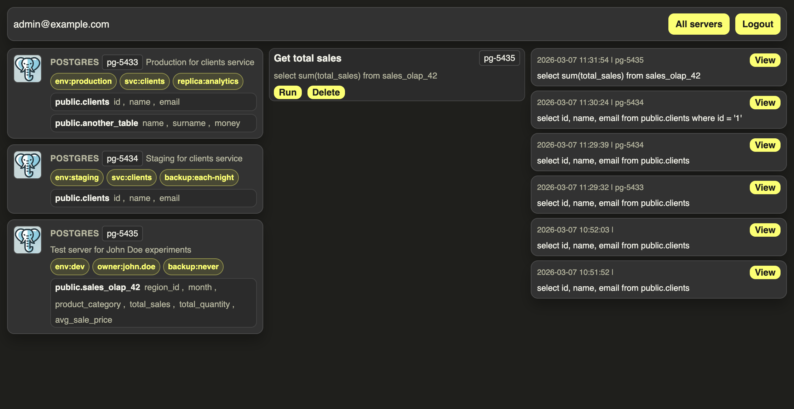
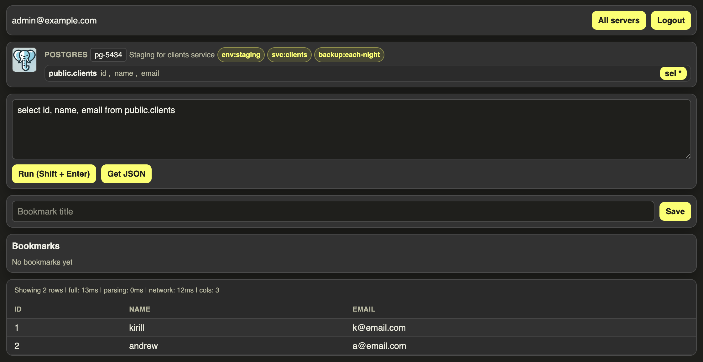
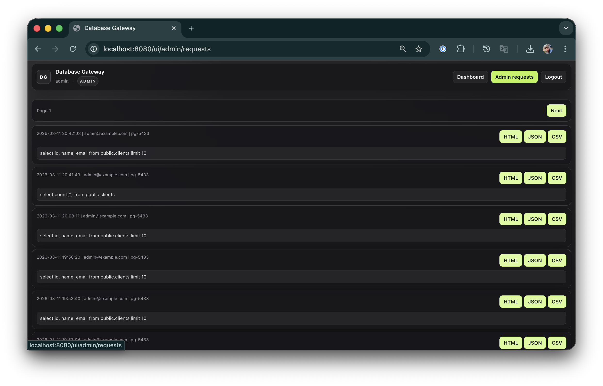
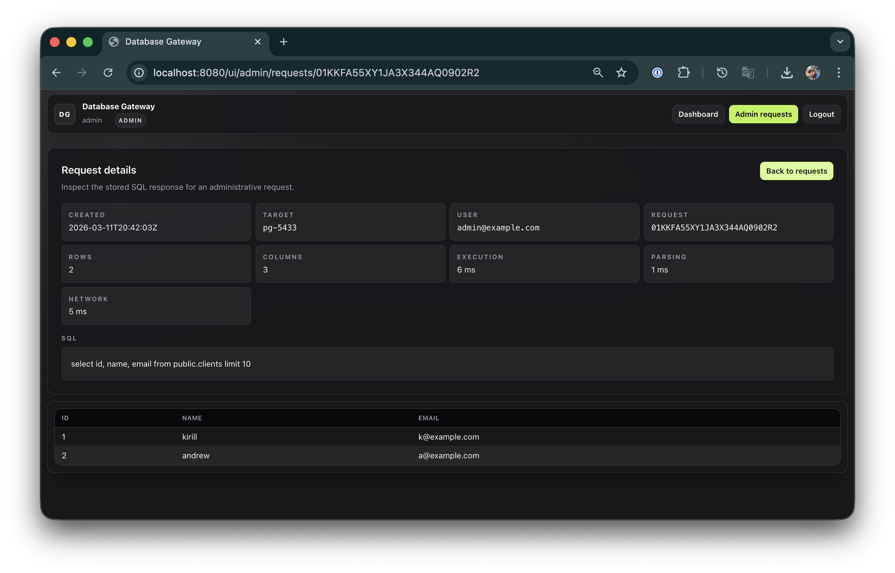

# Database Gateway

[](https://pkg.go.dev/github.com/kazhuravlev/database-gateway)
[](https://github.com/kazhuravlev/database-gateway/blob/master/LICENSE)
[](https://github.com/kazhuravlev/database-gateway/actions/workflows/test.yml)
[](https://github.com/kazhuravlev/database-gateway/actions/workflows/release.yml)
[](https://goreportcard.com/report/github.com/kazhuravlev/database-gateway)
[](https://codecov.io/gh/kazhuravlev/database-gateway)
[](https://github.com/avelino/awesome-go#database-tools)

This service provides a unified web interface for secure, controlled access to company databases. It enables employees
to run queries on `production` databases while enforcing Open Policy Agent (`OPA`) policies. For example, team leads may
have permissions to execute both `SELECT` and `INSERT` queries on certain tables, while other team members are
restricted to read-only (`SELECT`) access. This approach ensures that database interactions are managed safely and
that each user's access is tailored to their role and responsibilities.

## TL;DR

- Run approved SQL against multiple PostgreSQL targets from one web UI.
- Authenticate users via OIDC and enforce OPA rules by user, target, operation, and table.
- Store query results (with shareable links and execution metadata) for debugging and auditing.

## Table of Contents

- [TL;DR](#tldr)
- [Architecture Overview](#architecture-overview)
- [Quickstart with example setup](#quickstart-with-example-setup)
- [Features](#features)
- [Advanced Configuration](#advanced-configuration)
- [Performance Optimizations](#performance-optimizations)
- [Security Considerations](#security-considerations)
- [Edge Cases and Troubleshooting](#edge-cases-and-troubleshooting)
- [Interesting projects](#interesting-projects)

## Architecture Overview

This application acts as a secure gateway to multiple PostgreSQL instances, allowing authenticated users to run approved
queries through a unified web interface, with fine-grained OPA policies controlling access.


```
                     ┌───────────────────────────┐
                     │ PROD      ┌─────────────┐ │
                     │       ┌───┤  Postgres1  │ │
  ┌────────┐    ┌────────┐   │   └─────────────┘ │
  │  USER  │────│  DBGW  │───┼                   │
  └────────┘    └────────┘   │   ┌─────────────┐ │
                     │       └───┤  Postgres2  │ │
                     │           └─────────────┘ │
                     └───────────────────────────┘
```

### Components

1. **Local PostgreSQL Database**:
    - Stores query results and user profiles.
    - Acts as a cache for query results, allowing unique links for debugging without re-execution.

2. **Remote PostgreSQL Instances**:
    - Host production data and are accessed only through the app.
    - Queries are run only if authorized by OPA policies, limiting access to specific users, tables, and query types.

3. **OIDC Authentication**:
    - Users authenticate via an external OIDC provider.
    - User roles are mapped to OPA subjects, defining what queries each user can run.

4. **OPA Policies**:
    - Define user permissions at the instance, table, and query type levels.
    - Loaded from `.rego` files on disk and evaluated inside the gateway.

5. **Web Interface**:
    - Provides login, query submission, and result viewing.
    - Shows error feedback for unauthorized or restricted queries.

### Flow of Operations

1. **Authentication**: Users log in via OIDC, and their identity maps to OPA subjects.
2. **Query Submission**: Authorized queries are checked against OPA policies, then run on remote instances.
3. **Result Caching**: Results are stored locally with unique links for easy access and debugging.

This architecture ensures secure, controlled access to production data, balancing usability with data protection.

## Quickstart with example setup

Run commands to get a local dbgw instance with 3 PostgreSQL instances.

```shell
git clone https://github.com/kazhuravlev/database-gateway.git
cd database-gateway/example
docker compose up --pull always --force-recreate -d
open 'http://localhost:8080'
# Authentik and test users are bootstrapped automatically.
```

The example setup uses self-hosted Authentik as the OIDC provider.
OPA policies are loaded from `example/opa/basic/` and configured in [config.json](example/config.json).
Use `localhost` consistently for the example login flow, because the example OIDC redirect URL is
`http://localhost:8080/auth/callback`.

Bootstrap details for local Authentik:

1. OIDC app is created from `example/authentik-blueprint.yaml`.
2. Static users are created with password `password`:
   - `admin@example.com`
   - `user1@example.com`
3. `admin@example.com` belongs to `dbgw-admins` and `dbgw-users`; `user1@example.com` belongs to `dbgw-users`.
4. Authentik admin user:
   - `akadmin@example.com` / `password`



Choose `local-1`, run this query `select id, name from clients`, then click `Run`. 

Admins can inspect recent stored requests and open a detailed result view with execution metadata and exported formats.





## Features

### Security & Access Control

- [x] Integrates with OpenID Connect for user authentication
- [x] Enforces access filtering through OPA
- [x] Fine-grained table-level permissions
- [x] Schema-backed column allowlists
- [x] SQL parsing to enforce query type restrictions (SELECT, INSERT, etc.)
- [x] Query validation and sanitization
- [x] Session management with token expiration
- [x] Secure cookie handling

### Query UX

- [x] Supports any PostgreSQL wire-protocol database
- [x] Interactive web UI with keyboard shortcuts (Shift+Enter to run queries)
- [x] Provides query result output in HTML format
- [x] Provides query result output in JSON format
- [x] Query bookmarks (save, list, run, delete)
- [x] Recent queries feed on the main page (last 50 per user) with quick result access
- [x] Unique links for query results (useful for debugging)

### LRPC API

LRPC endpoint is exposed on the same port as the web facade:

- `GET /api/v1/token` (returns current session access token for frontend app)
- `POST /api/v1/:method`
- `GET /api/v1/schema`
- `GET /api/v1/query-results/export/:token`

Available methods:

- `targets.list.v1` - list user-available targets
- `targets.get.v1` - get a single target by `target_id`
- `bookmarks.list.v1` - list all bookmarks, or filter by optional `target_id`
- `bookmarks.add.v1` - save a bookmark for `target_id`, `title`, and `query`
- `bookmarks.delete.v1` - delete a bookmark by `id`
- `queries.list.v1` - list recent queries, with optional `limit`
- `query.run.v1` - run query for a target and return table data
- `query-results.get.v1` - get stored query result by `query_result_id`; users can read their own results and admins can read any user's result
- `query-results.export-link.v1` - issue a short-lived export link for `json` or `csv`

Download endpoints:

- `/api/v1/query-results/export/:token` - download an exported file using a short-lived signed token

All API requests require an OIDC access token in the header:

```json
Authorization: Bearer <access_token>
```

`params` are method-specific. User identity and role are resolved from the verified token claims.

### Observability & Performance

- [x] Includes query execution stats in results (full round trip, parsing time, network round trip)
- [x] Connection pooling for performance optimization

## Advanced Configuration

### Authentication

The service uses OIDC authentication:

```json
{
  "users": {
    "client_id": "db-gateway",
    "client_secret": "db-gateway-secret",
    "issuer_url": "http://localhost:9000/application/o/db-gateway/",
    "redirect_url": "http://localhost:8080/auth/callback",
    "access_token_audience": "db-gateway",
    "scopes": ["groups", "email", "profile"],
    "role_claim": "groups",
    "role_mapping": {
      "dbgw-admins": "admin",
      "dbgw-users": "user"
    }
  }
}
```

`access_token_audience` is optional. If omitted, `client_id` is used for access-token audience validation.

### Policy Configuration

OPA policy bundles are loaded from disk:

```json
{
  "policy": {
    "path": "./opa/basic"
  }
}
```

Each `.rego` file in the configured directory is compiled into the embedded OPA authorizer. Policies must define:

- `data.gateway.allow_target`
- `data.gateway.allow_query`

`policy.path` is resolved relative to the config file when it is not absolute.

Current OPA input:

```json
{
  "subjects": ["user:alice@example.com", "role:user"],
  "target": "local-1",
  "op": "select",
  "table": "public.clients"
}
```

Notes:

- `subjects` always includes both the concrete user principal and the mapped role principal
- `table` is always sent to OPA in canonical `schema.table` form
- unqualified SQL like `select id from clients` is normalized before policy evaluation
- policies run once for target visibility and once for each parsed query vector

### Database Connection Settings

Configure performance settings for each database connection:

```json
{
  "connection": {
    "host": "postgres1",
    "port": 5432,
    "user": "pg01",
    "password": "pg01",
    "db": "pg01",
    "use_ssl": false,
    "max_pool_size": 4
  }
}
```

For a complete working config, see [example/config.json](example/config.json).

## Performance Optimizations

- **Connection Pooling**: Configurable connection pool sizes for each database target
- **Query Result Caching**: Results are stored in the local database for later reference
- **Efficient Query Execution**: Parsed and validated for optimal performance

## Security Considerations

- **SQL Injection Protection**: All queries are parsed and validated before execution
- **No Direct Database Access**: Remote databases are only accessible through the gateway
- **Column-Level Restrictions**: schema validation limits which fields users can query
- **Query Type Restrictions**: Limit users to specific operations (SELECT, INSERT, etc.)
- **Session Security**: Secure cookie handling with configurable expiration
- **Error Handling**: Error messages are sanitized to prevent information leakage

## Edge Cases and Troubleshooting

- **Multiple Schema Support**: Tables can be specified with schema names (`schema.table`)
- **Complex Query Handling**: Some complex queries might be rejected by the parser
- **Connection Failures**: The service gracefully handles database connection failures
- **Missing Tables/Fields**: Queries referencing unknown tables or fields are rejected
- **Policy Compilation Errors**: invalid `.rego` files fail startup

## Interesting projects

- https://github.com/antlr/grammars-v4/tree/master/sql/postgresql/Go
- https://github.com/auxten/postgresql-parser
- https://github.com/blastrain/vitess-sqlparser
- https://github.com/cockroachdb/cockroach/pkg/sql/parser
- https://github.com/pganalyze/pg_query_go/
- https://github.com/pingcap/tidb/tree/master/pkg/parser
- https://github.com/topics/sql-parser?l=go
- https://github.com/vitessio/vitess
- https://github.com/xwb1989/sqlparser
